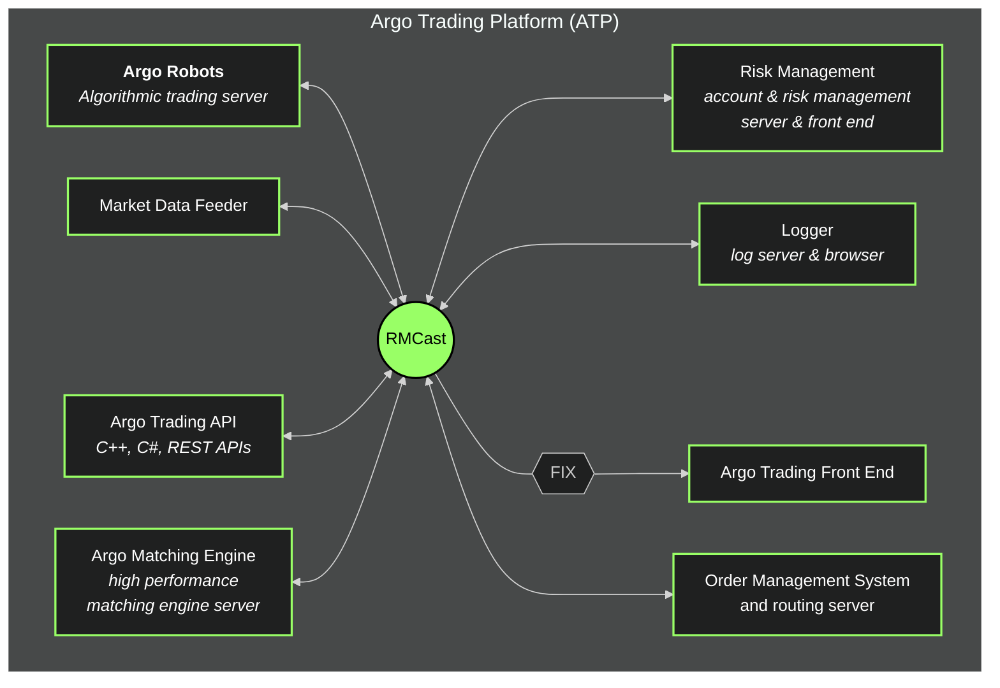

# Argo Trading Platform (ATP)

## What is Argo Trading Platform (ATP)?

Argo Trading Platform (ATP) is a set of high performance FinTech software components – servers, front-ends, APIs that work in concert to provide core technology for buy-side and sell-side financial institutions.

ATP includes ultra-fast order management system (OMS), user friendly desktop and web-based trading screens with charting and technical analysis, algorithmic trading servers, market data distribution and historical market data facility, risk management system, high capacity/low latency matching engine with price-time priority FIFO and pro-rata matching algorithms, implied IN and OUT logic, continuous and call-action trading sessions, Trading APIs, High Frequency Trading (HFT) framework and Reliable Multicast Messaging (RMCast) system.

ATP comes with order routing and connectivity modules for major trading venues and market data providers, including: CME,  ICE,  CBOT, NSE, MCX, MCX-SX, MOEX, Liffe, EUREX, Arca, Bats, many US dark pools and ATSes, BitMEX, HotSpot, Currenex, EBS, IKON, SIAC/Opra, TenFore, OpenTick, CQG.

ATP was successfully used in implementation of regulated and OTC,  equity, FOREX, cryptocurrency, commodity (spot and futures), energy markets, alternative trading and brokerage systems. ATP supports Central Limit Order Book (CLOB) and IOI/RFQ/Quote (Negotiation) workflows.

ATP server components are written on C++ for performance and portability.  ATP runs on Windows and Linux platforms.

**Bookmark** this [link](https://gitlab.dev.blockriver.tech/durafi/durafi/-/wikis/Argo/Wiki/Home) for quick access to the FutureWonder Argo Sub-Wiki table of contents

- **Config**
  - [ATP Config](/durafi/durafi/-/wikis/Argo/Wiki/Config/Home)
- **Core Concepts**
  - _Perpetual Futures_ 
    - [What is a Perpetual Future?](https://gitlab.dev.blockriver.tech/durafi/durafi/-/wikis/Argo/Wiki/Core-Concepts/Perpetual-Futures/What-is-a-Perpetual-Future%3F)
  - _Funding_
    - [What is Funding in Perpetual Futures](https://gitlab.dev.blockriver.tech/durafi/durafi/-/wikis/Argo/Wiki/Core-Concepts/Funding/What-is-Funding-in-Perpetual-Futures%3F)
  - _Market Makers_
    - [What is a Market Maker?](https://gitlab.dev.blockriver.tech/durafi/durafi/-/wikis/Argo/Wiki/Core-Concepts/Market-Makers/What-is-a-Market-Maker%3F)
  - _Margin_
    - [What is Margin Trading?](https://gitlab.dev.blockriver.tech/durafi/durafi/-/wikis/Argo/Wiki/Core-Concepts/Margin/What-is-Margin-Trading%3F)
  - _Data Messaging_
    - [Data Messaging Types](https://gitlab.dev.blockriver.tech/durafi/durafi/-/wikis/Argo/Wiki/Core-Concepts/Data-Messaging/Data-Messaging-Types)
- **Accounts**
  - [How Accounts work in ATP](https://gitlab.dev.blockriver.tech/durafi/durafi/-/wikis/Argo/Wiki/Accounts/How-Accounts-Work-in-ATP)
  - [How Balances work in ATP](https://gitlab.dev.blockriver.tech/durafi/durafi/-/wikis/Argo/Wiki/Accounts/How-Balances-Work-in-ATP)
- **Developer Experience**
  - [Debuggable Local Instance](/durafi/durafi/-/wikis/Argo/Debug-Configuration)
  - [How To](https://gitlab.dev.blockriver.tech/durafi/durafi/-/wikis/Argo/Wiki/Developer-Experience/How-To)
- **Matching Engine**
  - [What is the Argo Matching Engine?](https://gitlab.dev.blockriver.tech/durafi/durafi/-/wikis/Argo/Wiki/Matching-Engine/What-is-the-Argo-Matching-Engine%3F)
  - [Orders](https://gitlab.dev.blockriver.tech/durafi/durafi/-/wikis/Argo/Wiki/Matching-Engine/Orders) 
  - [Fills](https://gitlab.dev.blockriver.tech/durafi/durafi/-/wikis/Argo/Wiki/Matching-Engine/Fills)
- **RMCast**
  - [What is RMCast?](https://gitlab.dev.blockriver.tech/durafi/durafi/-/wikis/Argo/Wiki/RMCast/What-is-RMCast)
- **Order Management**
  - [What is the Argo Order Management System?](https://gitlab.dev.blockriver.tech/durafi/durafi/-/wikis/Argo/Wiki/Order-Management/What-is-Argo-Order-Management-System)
- **Algorithmic Trading Framework**
  - [What is Argo Algorithmic Trading Framework?](https://gitlab.dev.blockriver.tech/durafi/durafi/-/wikis/Argo/Wiki/Algo/What-is-Argo-Algorithmic-Trading-Framework%3F)
  - [AutoTrader(CLI)](https://gitlab.dev.blockriver.tech/durafi/durafi/-/wikis/Argo/Wiki/AutoTrader(CLI)/How-To)
- **exch_lib**
  - [Unique IDs](https://gitlab.dev.blockriver.tech/durafi/durafi/-/wikis/Argo/Wiki/exch_lib/Unique-IDs)
- **Market Data Distribution Facility**
  - [What is the Argo Market Data Distribution Facility?](https://gitlab.dev.blockriver.tech/durafi/durafi/-/wikis/Argo/Wiki/Market-Data-Distribution-Facility/What-is-the-Argo-Market-Data-Distribution-Facility%3F)
- **Argo API**
  - [What is the Argo API?](https://gitlab.dev.blockriver.tech/durafi/durafi/-/wikis/Argo/Wiki/API/What-is-the-Argo-API%3F)
- **Indices**
  - [What are Indices?](https://gitlab.dev.blockriver.tech/durafi/durafi/-/wikis/Argo/Wiki/Indices/What-are-Indices%3F)
- **Risk Management**
  - [What is Argo Risk Management?](https://gitlab.dev.blockriver.tech/durafi/durafi/-/wikis/Argo/Wiki/Risk-Management/What-is-Argo-Risk-Management)
  - [Risk Management Server (RMS)](https://gitlab.dev.blockriver.tech/durafi/durafi/-/wikis/Argo/Wiki/Risk-Management/Risk-Management-Server)
  - [Risk Management Front End (RMFE)](https://gitlab.dev.blockriver.tech/durafi/durafi/-/wikis/Argo/Wiki/Risk-Management/Risk-Management-Front-End)

Outdated but something to reference:

[Initial Source Code overview of argo/argo repo](Argo/Wiki/Initial-Technical-Source-Code-Overview)